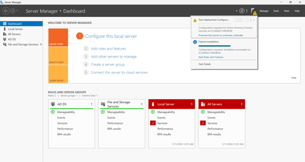
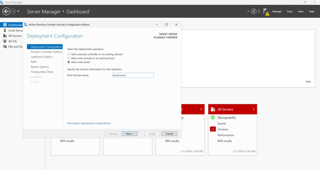
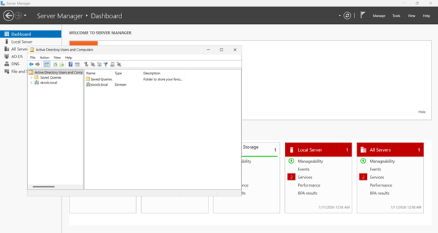

# active-directory-home-lab
# Windows Server VM — Active Directory Home Lab

## 🧩 Objective
Set up and configure **Active Directory Domain Services (AD DS)** on Windows Server to practice core Help Desk skills.

---

## 🧠 Skills Practiced
- Installing AD DS Role  
- Promoting a server to a Domain Controller  
- Configuring a new forest and domain  
- Validating domain administration using ADUC  

---

## 🧰 Tools Used
- Windows Server 2025  
- Server Manager  
- Active Directory Domain Services (AD DS)  
- Active Directory Users and Computers (ADUC)  

---

## 🪜 Steps Performed

### 1. Installed Active Directory Domain Services via Server Manager
Installed the **AD DS** role using **Server Manager → Add Roles and Features**.
  

---

### 2. Promoted the server to a Domain Controller
Used the post-deployment notification to start **“Promote this server to a domain controller”**.

---

### 3. Created a new forest and domain
Created a new forest and configured the root domain name for the lab environment.

---

### 4. Verified domain availability in ADUC
Opened **Active Directory Users and Computers (ADUC)** and confirmed the domain is present and manageable.

---

## ✅ Outcome
Successfully configured an Active Directory Domain Controller and verified the domain environment is operational and ready for user/group administration.

